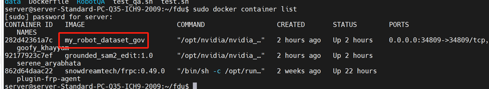

## docker部署情况
docker已部署在58.34.94.175服务器上，可直接通过34809端口访问，`/home/server/fdu/`目录里有test.sh和test_qa.sh提供接口调用示例


启动docker命令：
```bash
sudo docker run -d -p 34809:34809 --gpus all -it -v /home/server/fdu/data:/app/data my_robot_dataset_gov:1.0
```

其中：
1. /home/server/fdu/data为服务器实际存储文件路径，/app/data为docker内映射的路径，**接口的路径需要传docker内映射路径**
2. 34809为映射端口
3. my_robot_dataset_gov为做好的本地镜像，可在`/home/server/fdu/RobotQA/`路径通过`sudo docker build -t my_robot_dataset_gov:1.0 .`构建

### 问题
目前GPU版本还有bug，算法可通过cpu运行，只需在data_qa接口传入device=cpu即可


## 接口文档
fastapi默认集成swagger，可在服务器内通过127.0.0.1:34809/docs访问

**其中data_clean接口的cleaning_params为json**，`missing_value`为`delete`或`fill`
```json
{
  "input_path": "string",
  "output_path": "string",
  "cleaning_params": {
    "missing_value": "string",
    "remove_duplicates": "bool"
  }
}

```

curl --location --request POST 'http://127.0.0.1:8022/data-augmentation/stop?task_id' \
--header 'User-Agent: Apifox/1.0.0 (https://apifox.com)'


curl -X POST "http://127.0.0.1:8022/data-augmentation/stop?task_id=798cfc08-beff-4777-b815-bc12275387c5"
